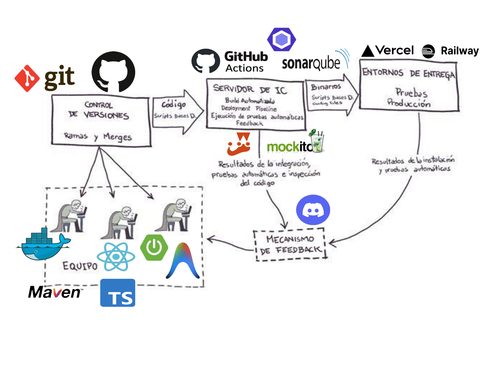

# S3-Lite CI/CD Pipelines

Este documento explica en detalle el funcionamiento de los flujos de integración y entrega continua (CI/CD) configurados para el proyecto **S3-Lite**, tanto para el frontend (React) como para el backend (Spring Boot).

La plataforma utilizada para ejecutar estos flujos es **GitHub Actions**. Existen dos archivos principales en el directorio `.github/workflows/`:
- `frontend-pipeline.yml`
- `backend-pipeline.yml`

---

## 🛠 Arquitectura General

El objetivo de los pipelines es garantizar la calidad del código mediante comprobaciones automáticas y desplegar automáticamente las nuevas versiones a los entornos de producción cuando todo es correcto.

Ambos pipelines tienen **notificaciones integradas hacia Discord**. Si un paso falla (por ejemplo, un test no pasa o la compilación falla), se enviará una alerta automática al canal de Discord configurado mediante un Webhook, incluyendo el link directo al commit que causó el fallo.

---

## 1. Backend Pipeline (`backend-pipeline.yml`)

El pipeline del backend está diseñado para aplicaciones Java con Spring Boot construidas con Maven.

### Triggers (Cuándo se ejecuta)
- Al hacer `push` a las ramas `main` o `develop`.
- Al abrir un `pull_request` hacia la rama `main`.
- Únicamente si los cambios detectados incluyen archivos dentro de la carpeta `s3lite-backend/`.

### Stages (Etapas)

1. **`build` (Compilación)**
   - Descarga el código y configura Java (JDK 21 Temurin).
   - Utiliza la caché de Maven para que las dependencias (`~/.m2`) se descarguen más rápido.
   - Ejecuta `./mvnw clean compile` para asegurar que el código fuente compila sin errores.

2. **`test` (Pruebas Unitarias)**
   - **Depende de**: `build`.
   - Ejecuta todas las pruebas usando `./mvnw test`.
   - Levanta el contexto de Spring (haciendo uso de una base de datos en memoria H2 para las pruebas y no de PostgreSQL).
   - Genera los reportes de **Surefire** y los sube como *Artifacts* de GitHub Actions para poder revisarlos si algo falla.
   - 🚨 *Notificación a Discord si los tests fallan.*

3. **`sonarcloud` (Análisis de Calidad Estática)**
   - **Depende de**: `build` y se ejecuta en paralelo con `test` (o después, dependiendo de la configuración actual en GitHub).
   - Ejecuta `./mvnw test-compile sonar:sonar` para enviar el código a SonarCloud.
   - SonarCloud evalúa vulnerabilidades, code smells, bugs, y la cobertura del código.
   - 🚨 *Notificación a Discord si SonarCloud detecta errores.*

4. **`deploy` (Despliegue a Producción)**
   - **Depende de**: `build`, `test` y `sonarcloud` (los tres deben pasar exitosamente).
   - **Condición estricta**: Solo se ejecuta si el push fue hecho directamente a la rama **`main`**. (Los pull requests o la rama `develop` no disparan el despliegue).
   - Utiliza la herramienta oficial de Railway (`bervProject/railway-deploy`) para hacer trigger del despliegue del servicio del backend utilizando un `RAILWAY_TOKEN`.

---

## 2. Frontend Pipeline (`frontend-pipeline.yml`)

El pipeline del frontend está diseñado para una aplicación de React (TypeScript) utilizando npm.

### Triggers (Cuándo se ejecuta)
- Al hacer `push` a las ramas `main` o `develop`.
- Al abrir un `pull_request` hacia la rama `main`.
- Únicamente si los cambios incluyen archivos dentro de la carpeta `s3lite-frontend/`.

### Stages (Etapas)

1. **`lint` (Análisis de Sintaxis y Formato)**
   - Configura Node.js versión 20.
   - Instala dependencias con `npm ci` (usando el `package-lock.json` y caché para optimizar tiempos).
   - Ejecuta ESLint: `npx eslint "src/**/*.{ts,tsx}" --max-warnings=0`.
   - Si hay advertencias o errores de sintaxis, el pipeline se detiene aquí.
   - 🚨 *Notificación a Discord si el Lint falla.*

2. **`test` (Pruebas Automatizadas)**
   - **Depende de**: `lint`.
   - Ejecuta `npm test -- --coverage` para correr la suite de pruebas en Jest/React Testing Library.
   - Genera un reporte de cobertura y lo sube como *Artifact* a GitHub Actions.
   - 🚨 *Notificación a Discord si las pruebas fallan.*

3. **`sonarcloud` (Análisis de Calidad Estática)**
   - **Depende de**: `test`.
   - Utiliza una acción oficial (`SonarSource/sonarcloud-github-action`) para subir el código y el reporte de cobertura generado en el paso anterior a SonarCloud.
   - Permite visualizar de manera web la salud del código del frontend.
   - 🚨 *Notificación a Discord si SonarCloud falla.*

4. **`deploy` (Despliegue a Producción)**
   - **Depende de**: `test` y `sonarcloud`.
   - **Condición estricta**: Solo se despliega si la rama es **`main`**.
   - Usa el CLI de Vercel (`amondnet/vercel-action`) junto con el `VERCEL_TOKEN` y los IDs del proyecto para hacer el build y desplegar la aplicación estática directamente en Vercel.

---

## 🛡 Manejo de Variables y Secretos

Para que estos pipelines puedan integrarse de manera segura con plataformas externas (Railway, Vercel, Discord y SonarCloud), dependen de **GitHub Secrets**. Si revisas los archivos YAML, verás referencias del tipo `${{ secrets.NOMBRE_DEL_SECRETO }}`. 

Los secretos indispensables actualmente configurados en tu repositorio deben ser:
- `DISCORD_WEBHOOK_URL`
- `SONAR_TOKEN`
- `RAILWAY_TOKEN`
- `VERCEL_TOKEN`
- `VERCEL_ORG_ID` y `VERCEL_PROJECT_ID`

Cualquier cambio en la URL del backend u otra constante del frontend también debería pasarse a través de estos secretos, como `REACT_APP_API_URL`.

---

## 💡 Resumen Práctico del Flujo de Trabajo

1. Creas una rama (`hotfixx`, `feature/algo`).
2. Trabajas y haces commits.
3. El código no se despliega todavía. Los pipelines corren para validar que no rompiste nada, pero se saltean la fase de **Deploy**.
4. Cuando todo está listo y verificado, haces un **Merge** hacia la rama `main`.
5. GitHub Actions detecta el cambio en `main`, ejecuta `build`, `test`, `sonarcloud` y finalmente **hace el Deploy** enviando la nueva versión a Vercel (frontend) y Railway (backend).
6. Te llega un aviso al canal de Discord de que el pipeline fue exitoso (si lo configuraste) o de que algo falló en el proceso.

---

## 🚀 Tecnologías Usadas

